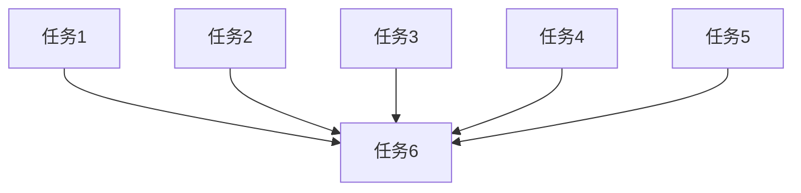

# 仓库删除功能 UI 调整

## 概述

调整昨天实现的仓库删除功能 UI 交互细节：
1. 删除触发键从 Delete 键改为 d 键
2. 二次确认弹框宽度从 50% 增加到 80%
3. 确认按键从 y/n 改为 Enter/Esc

## 风险评估

| 风险 | 可能性 | 影响 | 缓解措施 |
|------|--------|------|----------|
| 按键冲突 | 低 | 低 | d 键在仓库列表视图无其他功能绑定 |
| 用户习惯 | 低 | 低 | Enter/Esc 是标准确认/取消按键 |

## 角色分配

| 角色 | 人数 | 主要职责 |
|------|------|----------|
| frontend-dev | 1 | 修改键盘事件处理和 UI 渲染代码 |

## 任务清单

| 序号 | 任务 | 角色 | 依赖 | 状态 |
|------|------|------|------|------|
| 1 | 修改仓库删除触发键为 d | frontend-dev | - | pending |
| 2 | 修改仓库删除弹框宽度为 80% | frontend-dev | - | pending |
| 3 | 修改仓库删除确认按键为 Enter/Esc | frontend-dev | - | pending |
| 4 | 修改主目录删除弹框宽度为 80% | frontend-dev | - | pending |
| 5 | 修改主目录删除确认按键为 Enter/Esc | frontend-dev | - | pending |
| 6 | 编译验证修改 | frontend-dev | 1-5 | pending |

## 详细实现方案

### 任务 1: 修改仓库删除触发键为 d

**执行角色**: frontend-dev

**详细描述**:
- 文件: `src/handler/keyboard.rs` 第483行
- 将 `KeyCode::Delete` 改为 `KeyCode::Char('d')`

**输出物**:
- `src/handler/keyboard.rs`

**验收标准**:
- [ ] 按 d 键触发仓库删除确认弹框

### 任务 2: 修改仓库删除弹框宽度为 80%

**执行角色**: frontend-dev

**详细描述**:
- 文件: `src/ui/render.rs` 第404行
- 将 `centered_popup(50, 30, area)` 改为 `centered_popup(80, 30, area)`

**输出物**:
- `src/ui/render.rs`

**验收标准**:
- [ ] 仓库删除确认弹框宽度为 80%

### 任务 3: 修改仓库删除确认按键为 Enter/Esc

**执行角色**: frontend-dev

**详细描述**:
- 文件 1: `src/handler/keyboard.rs` 第1033-1042行
  - 确认: `KeyCode::Char('y') | KeyCode::Enter` → `KeyCode::Enter`
  - 取消: `KeyCode::Char('n') | KeyCode::Esc` → `KeyCode::Esc`
- 文件 2: `src/ui/render.rs` 第422-426行
  - 提示文本: `[y] Confirm Delete  [n] Cancel` → `[Enter] Confirm Delete  [Esc] Cancel`

**输出物**:
- `src/handler/keyboard.rs`
- `src/ui/render.rs`

**验收标准**:
- [ ] 按 Enter 确认删除仓库
- [ ] 按 Esc 取消删除仓库
- [ ] 弹框显示 Enter/Esc 提示

### 任务 4: 修改主目录删除弹框宽度为 80%

**执行角色**: frontend-dev

**详细描述**:
- 文件: `src/ui/render.rs` 第354行
- 将 `centered_popup(50, 30, area)` 改为 `centered_popup(80, 30, area)`

**输出物**:
- `src/ui/render.rs`

**验收标准**:
- [ ] 主目录删除确认弹框宽度为 80%

### 任务 5: 修改主目录删除确认按键为 Enter/Esc

**执行角色**: frontend-dev

**详细描述**:
- 文件 1: `src/handler/keyboard.rs` 第511-526行
  - 确认: `KeyCode::Char('y') | KeyCode::Enter` → `KeyCode::Enter`
  - 取消: `KeyCode::Char('n') | KeyCode::Esc` → `KeyCode::Esc`
- 文件 2: `src/ui/render.rs` 第374行
  - 提示文本: `[y] Confirm  [n] Cancel` → `[Enter] Confirm  [Esc] Cancel`

**输出物**:
- `src/handler/keyboard.rs`
- `src/ui/render.rs`

**验收标准**:
- [ ] 按 Enter 确认删除主目录
- [ ] 按 Esc 取消删除主目录
- [ ] 弹框显示 Enter/Esc 提示

### 任务 6: 编译验证修改

**执行角色**: frontend-dev

**详细描述**:
- 运行 `cargo build` 编译验证
- 运行 `cargo clippy` 检查代码风格

**输出物**:
- 编译成功

**验收标准**:
- [ ] 编译无错误
- [ ] clippy 无警告

## 依赖关系

所有任务相互独立，可并行执行，最后统一验证。

