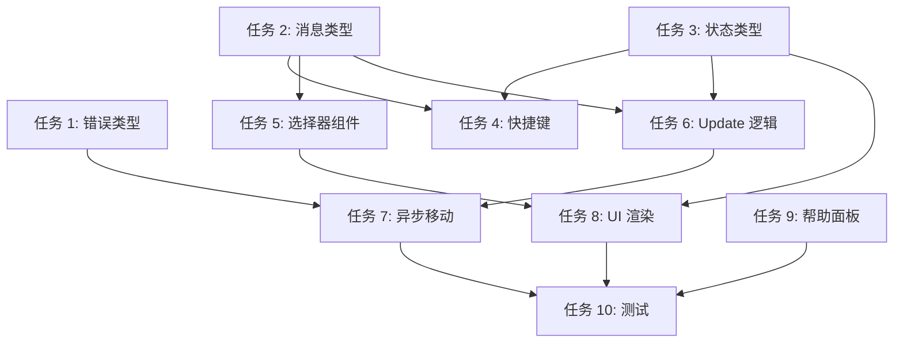

# Ctrl+M 移动仓库功能实现计划

## 概述

为仓库列表界面添加 **Ctrl+M** 快捷键功能，支持将选中的仓库移动到目标主目录。功能流程：
1. 按下 Ctrl+M 打开主目录选择器
2. 选择目标主目录
3. 二次确认移动操作
4. 如果目标目录存在同名仓库，提供重命名（加数字后缀）或跳过选项
5. 移动成功后刷新仓库列表并显示提示

## 风险评估

| 风险 | 可能性 | 影响 | 缓解措施 |
|------|--------|------|----------|
| 移动过程中断导致数据丢失 | 低 | 高 | 使用原子操作 `tokio::fs::rename` |
| 权限验证不完整 | 中 | 中 | 实现 5+1 层验证链，包含写入权限检查 |
| 刷新后仓库状态丢失 | 低 | 中 | 复用现有刷新逻辑，确保状态一致 |
| 冲突处理逻辑复杂 | 中 | 低 | 简化为二元选择：重命名或跳过 |

## 角色分配

| 角色 | 人数 | 主要职责 |
|------|------|----------|
| rust-dev | 1 | 核心类型定义、消息处理、异步操作实现 |
| frontend-dev | 1 | UI 组件、键盘处理、渲染逻辑 |
| tester | 1 | 功能测试、边界场景验证 |

## 任务清单

| 序号 | 任务 | 角色 | 依赖 | 状态 |
|------|------|------|------|------|
| 1 | 定义错误类型 MoveError | rust-dev | - | pending |
| 2 | 定义消息类型 (Cmd, AppMsg) | rust-dev | 1 | pending |
| 3 | 定义状态类型 (AppState, DirectoryChooserMode) | rust-dev | 2 | pending |
| 4 | 实现键盘快捷键 Ctrl+M | frontend-dev | 3 | pending |
| 5 | 创建主目录选择器组件 MainDirSelector | frontend-dev | - | pending |
| 6 | 实现状态流转逻辑 (Update) | rust-dev | 2,3 | pending |
| 7 | 实现异步移动操作 (Runtime) | rust-dev | 1,6 | pending |
| 8 | 实现 UI 渲染 (选择器 + 确认框) | frontend-dev | 3,5 | pending |
| 9 | 更新帮助面板快捷键说明 | frontend-dev | - | pending |
| 10 | 功能测试与边界验证 | tester | 7,8,9 | pending |

## 详细实现方案

### 任务 1: 定义错误类型 MoveError

**执行角色**: rust-dev

**详细描述**:
- 在 `src/error.rs` 中添加 `MoveError` 枚举类型
- 包含所有可能的移动操作错误场景
- 实现 `Display` 和 `Error` trait

**输出物**:
- `src/error.rs` - MoveError 枚举定义

**验收标准**:
- [ ] 包含 SameDirectory、TargetNotFound、PermissionDenied 等错误类型
- [ ] 包含 WritePermissionDenied 类型（写入权限检查）
- [ ] 实现 Display trait，支持格式化错误消息
- [ ] 编译通过

---

### 任务 2: 定义消息类型

**执行角色**: rust-dev

**详细描述**:
- 在 `src/app/msg.rs` 的 `Cmd` 枚举中添加 `MoveRepository` 命令
- 在 `AppMsg` 枚举中添加相关消息：
  - `TriggerMoveRepository` - 触发移动操作
  - `SelectMainDirForMove(usize)` - 选择主目录
  - `ConfirmMoveRepository { add_suffix: bool }` - 确认移动
  - `CancelMoveConfirmation` - 取消确认
  - `RepositoryMoved { ... }` - 移动结果

**输出物**:
- `src/app/msg.rs` - 新增消息类型

**验收标准**:
- [ ] Cmd 枚举包含 `MoveRepository { repo_path, target_dir, add_suffix }`
- [ ] AppMsg 枚举包含所有相关消息
- [ ] 消息字段类型正确（PathBuf, bool, Option 等）
- [ ] 编译通过

---

### 任务 3: 定义状态类型

**执行角色**: rust-dev

**详细描述**:
- 在 `src/app/state.rs` 的 `DirectoryChooserMode` 中添加 `SelectMoveTarget` 变体
- 在 `AppState` 枚举中添加：
  - `SelectingMoveTarget` - 选择主目录状态
  - `ConfirmingMove` - 确认移动状态
- 在 `priority()` 方法中设置正确的优先级（ConfirmingMove=5）

**输出物**:
- `src/app/state.rs` - 新增状态类型

**验收标准**:
- [ ] DirectoryChooserMode 包含 `SelectMoveTarget { source_repo }`
- [ ] AppState 包含 `SelectingMoveTarget` 和 `ConfirmingMove`
- [ ] 状态优先级正确设置
- [ ] 编译通过

---

### 任务 4: 实现键盘快捷键 Ctrl+M

**执行角色**: frontend-dev

**详细描述**:
- 在 `src/handler/keyboard.rs` 的 `handle_running_keys` 函数中添加 Ctrl+M 处理
- 创建 `handle_selecting_move_target` 函数处理选择器键盘事件
- 创建 `handle_move_confirmation_keys` 函数处理确认对话框键盘事件
- 在 `handle_key_event` 中添加新状态的分支

**输出物**:
- `src/handler/keyboard.rs` - 键盘事件处理逻辑

**验收标准**:
- [ ] Ctrl+M 触发 `AppMsg::TriggerMoveRepository`
- [ ] SelectingMoveTarget 状态下 ↑↓ 导航，Enter 确认，Esc 取消
- [ ] ConfirmingMove 状态下 Enter/Y/N 正确处理
- [ ] 键盘优先级正确（ConfirmingMove=5）
- [ ] 编译通过

---

### 任务 5: 创建主目录选择器组件 MainDirSelector

**执行角色**: frontend-dev

**详细描述**:
- 创建 `src/ui/widgets/main_dir_selector.rs`
- 实现 `MainDirSelector` Widget，显示主目录列表
- 支持选中高亮、仓库数量显示
- 复用 `CloneDialog` 中的选择器逻辑

**输出物**:
- `src/ui/widgets/main_dir_selector.rs` - 新组件
- `src/ui/widgets/mod.rs` - 导出组件

**验收标准**:
- [ ] 组件接收 `main_dirs: &[(usize, String, usize)]` 参数
- [ ] 显示选中高亮（▌ 前缀 + 背景色）
- [ ] 显示每个主目录的仓库数量
- [ ] 渲染标题、列表、帮助提示
- [ ] 在 `mod.rs` 中正确导出
- [ ] 编译通过

---

### 任务 6: 实现状态流转逻辑

**执行角色**: rust-dev

**详细描述**:
- 在 `src/app/update.rs` 中处理所有相关消息：
  - `TriggerMoveRepository` - 初始化选择器状态
  - `SelectMainDirForMove` - 检查同目录，进入确认状态
  - `ConfirmMoveRepository` - 触发异步移动命令
  - `CancelMoveConfirmation` - 返回 Running 状态
  - `RepositoryMoved` - 显示结果，刷新列表

**输出物**:
- `src/app/update.rs` - 状态流转逻辑

**验收标准**:
- [ ] TriggerMoveRepository 正确构建主目录列表
- [ ] SelectMainDirForMove 检查同目录冲突
- [ ] ConfirmMoveRepository 正确 dispatch Cmd
- [ ] RepositoryMoved 成功时刷新列表，失败时显示错误
- [ ] 所有状态流转正确
- [ ] 编译通过

---

### 任务 7: 实现异步移动操作

**执行角色**: rust-dev

**详细描述**:
- 在 `src/runtime/executor.rs` 中添加 `Cmd::MoveRepository` 处理器
- 实现 `validate_move_path` 异步验证函数（包含写入权限检查）
- 实现 `generate_unique_path` 生成唯一路径函数
- 使用 `tokio::fs::rename` 执行移动操作

**输出物**:
- `src/runtime/executor.rs` - 异步移动逻辑

**验收标准**:
- [ ] validate_move_path 包含 5+1 层验证（含写入权限）
- [ ] generate_unique_path 正确处理命名冲突
- [ ] 使用 tokio::fs::rename 执行原子移动
- [ ] 正确发送 RepositoryMoved 结果消息
- [ ] 错误消息简洁友好（中文）
- [ ] 编译通过

---

### 任务 8: 实现 UI 渲染

**执行角色**: frontend-dev

**详细描述**:
- 在 `src/ui/render.rs` 中添加 `render_main_dir_selector` 函数
- 在 `render` 函数的 `match` 中添加 `SelectingMoveTarget` 和 `ConfirmingMove` 分支
- 实现 `render_move_confirmation_dialog` 函数
- 确保模态对话框正确覆盖背景

**输出物**:
- `src/ui/render.rs` - UI 渲染逻辑

**验收标准**:
- [ ] SelectingMoveTarget 状态渲染 MainDirSelector
- [ ] ConfirmingMove 状态渲染确认对话框
- [ ] 对话框使用 Clear widget 实现模态效果
- [ ] 对话框居中显示（centered_popup/centered_rect）
- [ ] 样式与主题一致
- [ ] 编译通过

---

### 任务 9: 更新帮助面板

**执行角色**: frontend-dev

**详细描述**:
- 在 `src/ui/widgets/help_panel.rs` 的快捷键列表中添加 Ctrl+M 说明
- 格式与其他快捷键保持一致

**输出物**:
- `src/ui/widgets/help_panel.rs` - 快捷键帮助

**验收标准**:
- [ ] 包含 `Ctrl+M - 移动仓库到主目录` 说明
- [ ] 格式与其他快捷键一致
- [ ] 编译通过

---

### 任务 10: 功能测试与边界验证

**执行角色**: tester

**详细描述**:
- 测试正常移动流程（无冲突）
- 测试冲突处理（有冲突，选择重命名）
- 测试冲突处理（有冲突，选择跳过）
- 测试同目录移动（应报错）
- 测试权限不足场景
- 测试取消操作流程

**输出物**:
- 测试报告
- Bug 列表（如有）

**验收标准**:
- [ ] 正常移动流程测试通过
- [ ] 冲突重命名测试通过（生成 _1, _2 后缀）
- [ ] 冲突跳过测试通过
- [ ] 同目录检测测试通过
- [ ] 权限验证测试通过
- [ ] 取消操作测试通过（Esc 键）
- [ ] 刷新后仓库列表正确更新
- [ ] 错误提示友好且准确

---

## 依赖关系

## 实现顺序建议

**Phase 1: 基础定义** (任务 1-3)
- 定义所有类型、消息、状态
- 确保编译通过

**Phase 2: 核心逻辑** (任务 6-7)
- 实现 Update 状态流转
- 实现异步移动操作

**Phase 3: UI 实现** (任务 4-5, 8-9)
- 创建选择器组件
- 实现键盘处理
- 实现 UI 渲染

**Phase 4: 测试验证** (任务 10)
- 功能测试
- 边界场景验证
- Bug 修复

---

## 关键文件清单

| 文件 | 修改类型 | 说明 |
|------|---------|------|
| `src/error.rs` | 修改 | 添加 MoveError |
| `src/app/msg.rs` | 修改 | 添加消息类型 |
| `src/app/state.rs` | 修改 | 添加状态类型 |
| `src/handler/keyboard.rs` | 修改 | 键盘处理 |
| `src/app/update.rs` | 修改 | 状态流转 |
| `src/runtime/executor.rs` | 修改 | 异步操作 |
| `src/ui/widgets/main_dir_selector.rs` | 新建 | 选择器组件 |
| `src/ui/widgets/mod.rs` | 修改 | 导出组件 |
| `src/ui/render.rs` | 修改 | UI 渲染 |
| `src/ui/widgets/help_panel.rs` | 修改 | 帮助面板 |

---

**最后更新**: 2026-03-14  
**版本**: v1.0  
**状态**: 待执行
