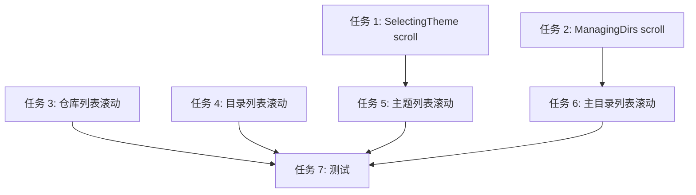

# 列表滚动修复计划

## 概述

修复仓库列表、目录列表、主题列表、主目录列表在导航时不会自动滚动的问题。

**问题**: 当选中项移动到可视区域外时，列表不会自动滚动，导致用户看不到选中项。

**预期效果**: 按 ↑↓ 导航时，列表自动滚动，确保选中项始终可见。

## 风险评估

| 风险 | 可能性 | 影响 | 缓解措施 |
|------|--------|------|----------|
| 滚动逻辑与现有导航冲突 | 低 | 中 | 保留现有导航逻辑，只添加滚动更新 |
| 终端高度获取失败 | 低 | 低 | 使用默认值保护 |
| 状态字段变更影响其他逻辑 | 中 | 中 | 全局搜索确认所有引用 |

## 角色分配

| 角色 | 人数 | 主要职责 |
|------|------|----------|
| rust-dev | 1 | 状态定义、消息处理、滚动逻辑 |
| frontend-dev | 1 | UI 渲染、组件修改 |
| tester | 1 | 功能测试、边界验证 |

## 任务清单

| 序号 | 任务 | 角色 | 依赖 | 状态 |
|------|------|------|------|------|
| 1 | 为 SelectingTheme 状态添加 scroll_offset 字段 | rust-dev | - | pending |
| 2 | 为 ManagingDirs 状态添加 scroll_offset 字段 | rust-dev | - | pending |
| 3 | 修复仓库列表滚动 (NextRepo/PreviousRepo) | rust-dev | - | pending |
| 4 | 修复目录列表滚动 (硬编码 visible_count) | rust-dev | - | pending |
| 5 | 修复主题列表滚动 (渲染时更新) | frontend-dev | 1 | pending |
| 6 | 修复主目录列表滚动 (渲染时更新) | frontend-dev | 2 | pending |
| 7 | 功能测试与边界验证 | tester | 3-6 | pending |

## 详细实现方案

### 任务 1: 为 SelectingTheme 状态添加 scroll_offset

**执行角色**: rust-dev

**文件**: `src/app/state.rs`

**修改**:
```rust
SelectingTheme {
    theme_list_state: ratatui::widgets::ListState,
    preview_theme: crate::ui::theme::Theme,
    scroll_offset: usize,  // 新增
}
```

**验收标准**:
- [ ] 编译通过
- [ ] 所有引用处正确更新

---

### 任务 2: 为 ManagingDirs 状态添加 scroll_offset

**执行角色**: rust-dev

**文件**: `src/app/state.rs`

**修改**:
```rust
ManagingDirs {
    list_state: ratatui::widgets::ListState,
    selected_dir_index: usize,
    editing: Option<MainDirEdit>,
    confirming_delete: bool,
    scroll_offset: usize,  // 新增
}
```

**验收标准**:
- [ ] 编译通过
- [ ] 所有引用处正确更新

---

### 任务 3: 修复仓库列表滚动

**执行角色**: rust-dev

**文件**: `src/app/update.rs`

**修改**: 在 `AppMsg::NextRepo` 和 `AppMsg::PreviousRepo` 处理中添加:
```rust
app.update_scroll_offset(terminal_height);
```

**问题**: 消息处理无法访问 terminal_height

**解决方案**: 在 `src/ui/render.rs` 的 `render_repo_list` 函数中，渲染前调用:
```rust
app.update_scroll_offset(area.height);
```

**验收标准**:
- [ ] 按 ↓ 导航时，选中项超出可视区域时列表自动向上滚动
- [ ] 按 ↑ 导航时，选中项超出可视区域时列表自动向下滚动
- [ ] 编译通过

---

### 任务 4: 修复目录列表滚动

**执行角色**: rust-dev

**文件**: `src/handler/keyboard.rs`

**修改**: `AppMsg::DirectoryNavDown` 和 `AppMsg::DirectoryNavUp` 中:
- 移除硬编码 `visible_count = 15`
- 改为动态计算（从渲染时传递）

**验收标准**:
- [ ] 滚动行为正确
- [ ] 编译通过

---

### 任务 5: 修复主题列表滚动

**执行角色**: frontend-dev

**文件**: 
- `src/ui/render.rs` - `render_theme_selector`
- `src/app/update.rs` - `AppMsg::ThemeNavDown/Up`

**修改**:
1. 在 `AppMsg::ThemeNavDown/Up` 中更新 `scroll_offset`
2. 在 `render_theme_selector` 中传递 `scroll_offset` 给组件
3. 修改 `ThemeSelector` 组件支持滚动

**验收标准**:
- [ ] 主题列表导航时自动滚动
- [ ] 编译通过

---

### 任务 6: 修复主目录列表滚动

**执行角色**: frontend-dev

**文件**:
- `src/ui/render.rs` - `render_main_dir_manager`
- `src/app/update.rs` - `AppMsg::MainDirNavDown/Up`

**修改**:
1. 在 `AppMsg::MainDirNavDown/Up` 中更新 `scroll_offset`
2. 在 `render_main_dir_manager` 中传递 `scroll_offset` 给组件
3. 修改 `MainDirManager` 组件支持滚动

**验收标准**:
- [ ] 主目录列表导航时自动滚动
- [ ] 编译通过

---

### 任务 7: 功能测试

**执行角色**: tester

**测试场景**:
1. 仓库列表：10 项，可见 3 项，向下导航到第 4 项
2. 目录列表：进入深层目录，导航测试
3. 主题列表：多个主题，导航测试
4. 主目录列表：多个主目录，导航测试

**验收标准**:
- [ ] 所有列表导航时选中项始终可见
- [ ] 循环导航（首尾）时滚动正确
- [ ] 无崩溃、无异常

---

## 依赖关系



## 实现顺序建议

**Phase 1: 状态定义** (任务 1-2)
- 添加 scroll_offset 字段
- 确保编译通过

**Phase 2: 核心修复** (任务 3-4)
- 修复仓库列表和目录列表
- 这两个最常用

**Phase 3: UI 完善** (任务 5-6)
- 修复主题列表和主目录列表

**Phase 4: 测试验证** (任务 7)
- 全面测试
- Bug 修复

---

## 关键文件清单

| 文件 | 修改类型 | 说明 |
|------|---------|------|
| `src/app/state.rs` | 修改 | 添加 scroll_offset 字段 |
| `src/app/update.rs` | 修改 | 消息处理中添加滚动逻辑 |
| `src/ui/render.rs` | 修改 | 渲染时更新滚动偏移 |
| `src/ui/widgets/theme_selector.rs` | 修改 | 支持滚动偏移渲染 |
| `src/ui/widgets/main_dir_manager.rs` | 修改 | 支持滚动偏移渲染 |

---

**最后更新**: 2026-03-14  
**版本**: v1.0  
**状态**: 待执行
