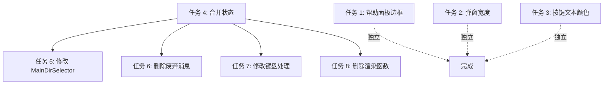

# 移动仓库弹窗 UI 修复

## 概述

修复移动仓库弹窗的 UI 问题，包括：
1. 帮助面板边框使用主题色
2. 移动弹窗宽度改为 80%
3. 移动弹窗底部按键文本使用主题色
4. 合并二次确认弹窗到选择主目录弹窗内，减少用户操作步骤

## 风险评估

| 风险 | 可能性 | 影响 | 缓解措施 |
|------|--------|------|----------|
| 状态合并后键盘事件处理遗漏 | 中 | 中 | 仔细检查所有 `AppState` 匹配分支，使用 grep 全局搜索确认 |
| 删除 `ConfirmMoveRepository` 后有遗留引用 | 中 | 中 | 使用 grep 全局搜索确认所有引用 |
| 弹窗布局在小终端下显示异常 | 低 | 低 | 保持最小尺寸验证，现有函数有 `min_width/height` 保护 |

## 角色分配

| 角色 | 人数 | 主要职责 |
|------|------|----------|
| frontend-dev | 1 | TUI 界面修改、状态管理、键盘事件处理 |

## 任务清单

| 序号 | 任务 | 角色 | 依赖 | 状态 |
|------|------|------|------|------|
| 1 | 修复帮助面板边框使用主题色 | frontend-dev | - | pending |
| 2 | 修改移动弹窗宽度为 80% | frontend-dev | - | pending |
| 3 | 修改移动弹窗底部按键文本使用主题色 | frontend-dev | - | pending |
| 4 | 合并 `SelectingMoveTarget` 和 `ConfirmingMove` 状态 | frontend-dev | - | pending |
| 5 | 修改 `MainDirSelector` 组件显示确认信息 | frontend-dev | 4 | pending |
| 6 | 删除废弃的 `ConfirmMoveRepository` 消息和处理逻辑 | frontend-dev | 4 | pending |
| 7 | 修改键盘处理逻辑整合确认操作 | frontend-dev | 4 | pending |
| 8 | 删除 `render_move_confirmation_dialog` 函数 | frontend-dev | 4 | pending |

## 详细实现方案

### 任务 1: 修复帮助面板边框使用主题色

**执行角色**: frontend-dev

**详细描述**:
- 修改 `HelpPanel::render` 方法签名，添加 `theme: &Theme` 参数
- 将边框样式从硬编码的 `Color::Green` 改为 `theme.colors.primary.into()`
- 修改调用处 `src/ui/render.rs` 传递 `theme` 参数

**输出物**:
- `src/ui/widgets/help_panel.rs` - 修改 render 方法和边框样式
- `src/ui/render.rs` - 修改 HelpPanel 调用

**验收标准**:
- [ ] 帮助面板边框颜色与主题色一致
- [ ] 切换主题时边框颜色随之改变
- [ ] 代码编译通过

### 任务 2: 修改移动弹窗宽度为 80%

**执行角色**: frontend-dev

**详细描述**:
- 修改 `centered_main_dir_selector_rect` 函数
- 将垂直和水平布局的百分比从 50% 改为 80%

**输出物**:
- `src/ui/widgets/main_dir_selector.rs` - 修改居中布局计算

**验收标准**:
- [ ] 移动弹窗宽度占终端 80%
- [ ] 移动弹窗高度占终端 80%
- [ ] 弹窗保持居中

### 任务 3: 修改移动弹窗底部按键文本使用主题色

**执行角色**: frontend-dev

**详细描述**:
- 修改 `MainDirSelector::render` 方法中的帮助文本样式
- 从 `secondary_text_style()` 改为 `primary_text_style()`

**输出物**:
- `src/ui/widgets/main_dir_selector.rs` - 修改帮助文本样式

**验收标准**:
- [ ] 底部按键文本使用主题色
- [ ] 切换主题时文本颜色随之改变

### 任务 4: 合并 `SelectingMoveTarget` 和 `ConfirmingMove` 状态

**执行角色**: frontend-dev

**详细描述**:
- 修改 `AppState::SelectingMoveTarget` 添加字段：
  - `target_path: Option<PathBuf>`
  - `conflict_exists: bool`
- 删除 `AppState::ConfirmingMove` 状态
- 修改 `src/app/update.rs` 中的状态转换逻辑：
  - `SelectMainDirForMove` 不再进入 `ConfirmingMove`，而是更新当前状态的字段
  - 直接在 `SelectMainDirForMove` 中执行移动操作

**输出物**:
- `src/app/state.rs` - 修改 AppState 枚举
- `src/app/update.rs` - 修改消息处理逻辑

**验收标准**:
- [ ] `ConfirmingMove` 状态被删除
- [ ] `SelectingMoveTarget` 包含冲突检测信息
- [ ] 选择主目录后直接执行移动操作
- [ ] 代码编译通过

### 任务 5: 修改 `MainDirSelector` 组件显示确认信息

**执行角色**: frontend-dev

**详细描述**:
- 修改 `MainDirSelector` 结构体添加字段：
  - `repo_name: Option<&'a str>`
  - `conflict_exists: bool`
  - `target_path: Option<PathBuf>`
- 修改 `render` 方法，在列表下方显示确认信息区域：
  - 仓库名称
  - 目标路径（完整路径）
  - 冲突警告（如果有）
  - 操作提示

**输出物**:
- `src/ui/widgets/main_dir_selector.rs` - 修改组件结构和渲染逻辑

**验收标准**:
- [ ] 弹窗内显示仓库名称
- [ ] 弹窗内显示完整目标路径
- [ ] 有冲突时显示警告信息
- [ ] UI 布局整洁美观

### 任务 6: 删除废弃的 `ConfirmMoveRepository` 消息和处理逻辑

**执行角色**: frontend-dev

**详细描述**:
- 删除 `src/app/msg.rs` 中的 `ConfirmMoveRepository` 消息
- 删除 `src/app/update.rs` 中的 `AppMsg::ConfirmMoveRepository` 处理分支
- 删除 `src/runtime/executor.rs` 中的相关引用（如有）

**输出物**:
- `src/app/msg.rs` - 删除消息定义
- `src/app/update.rs` - 删除消息处理

**验收标准**:
- [ ] `ConfirmMoveRepository` 消息被删除
- [ ] 所有引用被清理
- [ ] 代码编译通过
- [ ] grep 搜索无遗留引用

### 任务 7: 修改键盘处理逻辑整合确认操作

**执行角色**: frontend-dev

**详细描述**:
- 删除 `handle_move_confirmation_keys` 函数
- 删除 `AppState::ConfirmingMove` 的键盘处理分支
- 在主目录选择键盘处理中添加 Enter 确认逻辑

**输出物**:
- `src/handler/keyboard.rs` - 修改键盘事件处理

**验收标准**:
- [ ] 按 Enter 直接确认移动
- [ ] 按 Esc 取消操作
- [ ] 删除废弃的键盘处理函数

### 任务 8: 删除 `render_move_confirmation_dialog` 函数

**执行角色**: frontend-dev

**详细描述**:
- 删除 `src/ui/render.rs` 中的 `render_move_confirmation_dialog` 函数
- 删除 `AppState::ConfirmingMove` 的渲染分支
- 修改 `render_main_dir_selector` 函数传递确认信息给组件

**输出物**:
- `src/ui/render.rs` - 删除函数和分支

**验收标准**:
- [ ] `render_move_confirmation_dialog` 函数被删除
- [ ] `ConfirmingMove` 渲染分支被删除
- [ ] `render_main_dir_selector` 正确传递确认信息
- [ ] 代码编译通过

## 依赖关系

## 键盘映射变更

| 状态 | 按键 | 变更前 | 变更后 |
|------|------|--------|--------|
| SelectingMoveTarget | Enter | 选择主目录，进入二次确认 | 直接确认移动 |
| SelectingMoveTarget | Esc | 取消 | 取消（不变） |
| SelectingMoveTarget | ↑/↓ | 导航（不变） | 导航（不变） |
| ConfirmingMove | Y/Enter | 确认移动 | 状态删除 |
| ConfirmingMove | N/Esc | 取消 | 状态删除 |

## 测试验证

完成所有修改后需要验证：
1. 帮助面板边框颜色正确
2. 移动弹窗宽度为 80%
3. 移动弹窗按键文本颜色正确
4. 按 M 打开移动弹窗
5. 选择主目录后显示确认信息
6. 按 Enter 直接执行移动
7. 按 Esc 取消操作
8. 冲突情况下显示警告信息
